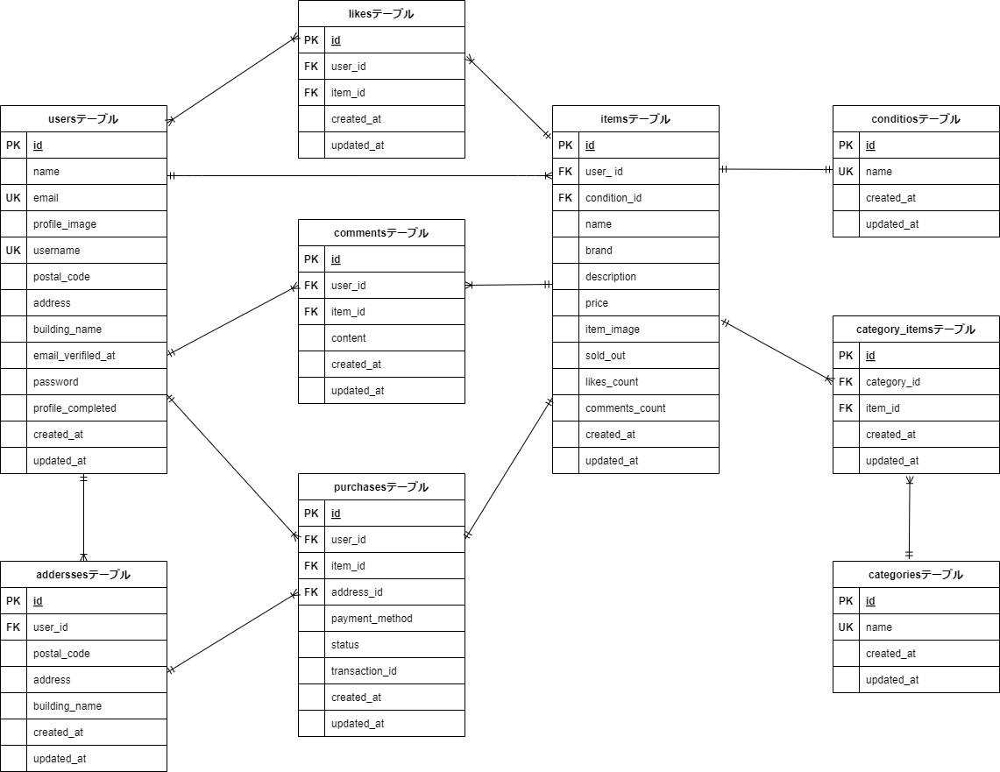

# アプリケーション名

フリマアプリ
ログイン後、商品の出品と購入が出来ます。

## 作成した目的

模擬案件を通して実践に近い開発経験を積み、定義された要件を実装する能力を身につけること。

## 機能一覧

ログイン機能、メール認証機能（認証機能 Fortify）（メール受信テストは mailhog）  
商品一覧と詳細ページで商品名の検索機能、商品の出品と購入機能（stripe 決済）

## 使用技術（実行環境）

・PHP7.4
・Laravel8.83.27
・MySQL8.0.26

## テーブル設計

本プロジェクトの詳細なテーブル設計は、以下の Google スプレッドシートにまとめています。

**[テーブル設計シート (Google スプレッドシート)](https://docs.google.com/spreadsheets/d/1AUlHz8zNAvwpKfZsBWg9MHVZcBCvu6NGlVGuadmne2k/edit?gid=1188247583#gid=1188247583)**

### **1. users テーブル（ユーザー情報）**

| カラム名          | データ型     | NOT NULL | 主キー | 外部キー | 説明                           |
| ----------------- | ------------ | -------- | ------ | -------- | ------------------------------ |
| id                | BIGINT       | ○        | ○      |          | ユーザー ID                    |
| name              | VARCHAR(255) | ○        |        |          | ユーザー名                     |
| email             | VARCHAR(255) | ○        |        |          | メールアドレス（ユニーク制約） |
| profile_image     | VARCHAR(255) |          |        |          | プロフィール画像               |
| username          | VARCHAR(255) | ○        |        |          | ユーザー名（ニックネームなど） |
| postal_code       | VARCHAR(255) |          |        |          | 郵便番号                       |
| address           | VARCHAR(255) |          |        |          | 住所                           |
| building_name     | VARCHAR(255) |          |        |          | 建物名                         |
| password          | VARCHAR(255) | ○        |        |          | ハッシュ化されたパスワード     |
| profile_completed | TINYINT(1)   | ○        |        |          | プロフィール完了フラグ         |
| created_at        | TIMESTAMP    |          |        |          | 作成日時                       |
| updated_at        | TIMESTAMP    |          |        |          | 更新日時                       |

---

### **2. conditions テーブル（商品の状態）**

| カラム名   | データ型     | NOT NULL | 主キー | 外部キー | 説明                       |
| ---------- | ------------ | -------- | ------ | -------- | -------------------------- |
| id         | BIGINT       | ○        | ○      |          | 商品状態の ID              |
| name       | VARCHAR(255) | ○        |        |          | 状態名（良好・傷ありなど） |
| created_at | TIMESTAMP    |          |        |          | 作成日時                   |
| updated_at | TIMESTAMP    |          |        |          | 更新日時                   |

---

### **3. addresses テーブル（配送先住所）**

| カラム名      | データ型     | NOT NULL | 主キー | 外部キー  | 説明                    |
| ------------- | ------------ | -------- | ------ | --------- | ----------------------- |
| id            | BIGINT       | ○        | ○      |           | 住所 ID                 |
| user_id       | BIGINT       | ○        |        | users(id) | ユーザー ID（外部キー） |
| postal_code   | VARCHAR(8)   | ○        |        |           | 郵便番号                |
| address       | VARCHAR(255) | ○        |        |           | 住所                    |
| building_name | VARCHAR(255) |          |        |           | 建物名                  |
| created_at    | TIMESTAMP    |          |        |           | 作成日時                |
| updated_at    | TIMESTAMP    |          |        |           | 更新日時                |

---

### **4. items テーブル（商品情報）**

| カラム名       | データ型     | NOT NULL | 主キー | 外部キー       | 説明                      |
| -------------- | ------------ | -------- | ------ | -------------- | ------------------------- |
| id             | BIGINT       | ○        | ○      |                | 商品 ID                   |
| user_id        | BIGINT       | ○        |        | users(id)      | 出品者 ID（外部キー）     |
| condition_id   | BIGINT       | ○        |        | conditions(id) | 商品の状態 ID（外部キー） |
| name           | VARCHAR(255) | ○        |        |                | 商品名                    |
| brand          | VARCHAR(255) | ○        |        |                | ブランド名                |
| description    | VARCHAR(255) | ○        |        |                | 商品説明                  |
| price          | INTEGER      | ○        |        |                | 価格                      |
| item_image     | VARCHAR(255) |          |        |                | 商品画像                  |
| sold_out       | TINYINT(1)   | ○        |        |                | 売り切れフラグ            |
| likes_count    | INTEGER      | ○        |        |                | いいね数                  |
| comments_count | INTEGER      | ○        |        |                | コメント数                |
| created_at     | TIMESTAMP    |          |        |                | 作成日時                  |
| updated_at     | TIMESTAMP    |          |        |                | 更新日時                  |

---

### **5. categories テーブル（カテゴリ情報）**

| カラム名   | データ型     | NOT NULL | 主キー | 外部キー | 説明        |
| ---------- | ------------ | -------- | ------ | -------- | ----------- |
| id         | BIGINT       | ○        | ○      |          | カテゴリ ID |
| name       | VARCHAR(255) | ○        |        |          | カテゴリ名  |
| created_at | TIMESTAMP    |          |        |          | 作成日時    |
| updated_at | TIMESTAMP    |          |        |          | 更新日時    |

---

### **6. category_items テーブル（カテゴリと商品を紐づける中間テーブル）**

| カラム名    | データ型  | NOT NULL | 主キー | 外部キー       | 説明                    |
| ----------- | --------- | -------- | ------ | -------------- | ----------------------- |
| id          | BIGINT    | ○        | ○      |                | カテゴリアイテム ID     |
| category_id | BIGINT    | ○        |        | categories(id) | カテゴリ ID（外部キー） |
| item_id     | BIGINT    | ○        |        | items(id)      | 商品 ID（外部キー）     |
| created_at  | TIMESTAMP |          |        |                | 作成日時                |
| updated_at  | TIMESTAMP |          |        |                | 更新日時                |

---

### **7. purchases テーブル（購入情報）**

| カラム名       | データ型     | NOT NULL | 主キー | 外部キー      | 説明                                           |
| -------------- | ------------ | -------- | ------ | ------------- | ---------------------------------------------- |
| id             | BIGINT       | ○        | ○      |               | 購入 ID                                        |
| user_id        | BIGINT       | ○        |        | users(id)     | 購入者 ID（外部キー）                          |
| item_id        | BIGINT       | ○        |        | items(id)     | 購入した商品 ID（外部キー）                    |
| address_id     | BIGINT       | ○        |        | addresses(id) | 配送先住所 ID（外部キー）                      |
| payment_method | VARCHAR(255) | ○        |        |               | 支払い方法                                     |
| status         | VARCHAR(255) | ○        |        |               | 購入ステータス                                 |
| transaction_id | VARCHAR(255) |          |        |               | 取引 ID（決済プロバイダのトランザクション ID） |
| created_at     | TIMESTAMP    |          |        |               | 作成日時                                       |
| updated_at     | TIMESTAMP    |          |        |               | 更新日時                                       |

---

### **8. likes テーブル（お気に入り情報）**

| カラム名   | データ型  | NOT NULL | 主キー | 外部キー  | 説明                    |
| ---------- | --------- | -------- | ------ | --------- | ----------------------- |
| id         | BIGINT    | ○        | ○      |           | いいね ID               |
| user_id    | BIGINT    | ○        |        | users(id) | ユーザー ID（外部キー） |
| item_id    | BIGINT    | ○        |        | items(id) | 商品 ID（外部キー）     |
| created_at | TIMESTAMP |          |        |           | 作成日時                |
| updated_at | TIMESTAMP |          |        |           | 更新日時                |

---

### **9. comments テーブル（コメント情報）**

| カラム名   | データ型     | NOT NULL | 主キー | 外部キー  | 説明                                    |
| ---------- | ------------ | -------- | ------ | --------- | --------------------------------------- |
| id         | BIGINT       | ○        | ○      |           | コメント ID                             |
| user_id    | BIGINT       | ○        |        | users(id) | コメント投稿者のユーザー ID（外部キー） |
| item_id    | BIGINT       | ○        |        | items(id) | コメント対象の商品 ID（外部キー）       |
| content    | VARCHAR(255) | ○        |        |           | コメント内容                            |
| created_at | TIMESTAMP    |          |        |           | 作成日時                                |
| updated_at | TIMESTAMP    |          |        |           | 更新日時                                |

---

## ER 図



## 環境構築

➀ リポジトリのクローン

GitHub からプロジェクトをローカル環境にクローンします。

```
git clone https://github.com/chiemi123/coachtech-flea-market.git
```

```
cd coachtech-flea-market
```

➁Docker 環境のセットアップ

Docker コンテナの起動
以下のコマンドで Docker コンテナを起動します。

```
docker-compose up -d --build
```

```
code .
```

➂Laravel のセットアップ

以下のコマンドで php コンテナにログインします。

```
docker-compose exec php bash
```

Laravel パッケージのインストール
以下のコマンドで Laravel パッケージのインストールをします。

```
composer install
```

.env ファイルを作成
プロジェクトルートに .env ファイルを作成し、.env.example をコピーします。

```
cp .env.example .env
```

➃ アプリケーションキーの作成

以下のコマンドでアプリケーションキーを生成します。

```
php artisan key:generate
```

➄ マイグレーションの実行

以下のコマンドでデータベースのマイグレーションを実行します。

```
php artisan migrate
```

マイグレーションの実行後、ブラウザで以下にアクセスできるか確認します。

http://localhost

➅ シーダーの実行

以下のコマンドでシーダーを実行します。

```
php artisan migrate --seed
```

## 🔑 認証機能について

本アプリケーションでは、ユーザー認証の仕組みに [Laravel Fortify](https://laravel.com/docs/fortify) を使用しています。

### 使用バージョン

-   Laravel Fortify v1.19.1

### 主な機能

-   ログイン・新規登録
-   パスワードのリセット
-   メールアドレス認証（オプション）

### 導入手順

プロジェクトの初期設定時に以下のコマンドを実行してください。

```bash
composer install
php artisan migrate
php artisan vendor:publish --provider="Laravel\Fortify\FortifyServiceProvider"
```

## テスト用アカウント

メールアドレス：test@yahoo.co.jp

パスワード　　：yamadayamada

## ** 商品画像の保存仕様**

本アプリでは、出品された商品の画像は **Laravel のストレージ（storage フォルダ）** に保存されます。  
デフォルトでは `storage/app/public/item_images` に画像が格納され、`public/storage` にシンボリックリンクを作成することで、Web からアクセス可能になります。

#### **1. 画像の保存先**

| ディレクトリ                      | 説明                               |
| --------------------------------- | ---------------------------------- |
| `storage/app/public/item_images/` | アップロードされた画像の保存場所   |
| `public/storage/item_images/`     | Web アクセス用のシンボリックリンク |

シンボリックリンクの作成

画像を public ディレクトリからアクセス可能にするために、以下のコマンドを実行してください。

```
php artisan storage:link
```

## MailHog のセットアップ（開発環境用メール送信）

MailHog を使用すると、開発環境で送信されるメールをローカルで確認できます。

MailHog の起動
MailHog は docker-compose up -d の時点で起動しています。
ブラウザで以下にアクセスすると、送信されたメールを確認できます。

http://localhost:8025

.env のメール設定
.env ファイルを以下のように変更します。

```env

MAIL_MAILER=smtp
MAIL_HOST=mailhog
MAIL_PORT=1025
MAIL_USERNAME=null
MAIL_PASSWORD=null
MAIL_ENCRYPTION=null
MAIL_FROM_ADDRESS="example@example.com"
MAIL_FROM_NAME="Example"

```

その後、Docker コンテナを以下のコマンドで再起動します。

```
docker-compose restart
```

アプリケーションの起動

nginx / Apache を使用する場合

```
docker-compose up -d
```

ブラウザで http://localhost にアクセスしてください。

php artisan serve を使用する場合

```
docker-compose exec app php artisan serve --host=0.0.0.0 --port=8000
```

ブラウザで http://localhost:8000 にアクセスしてください。

## Stripe 決済のセットアップ

### **1. Stripe アカウントを作成**

Stripe の API キーを取得するには、まず **Stripe の公式サイトでアカウントを作成** する必要があります。

🔹 **Stripe 公式サイト:** [https://dashboard.stripe.com/register](https://dashboard.stripe.com/register)

1. 上記のリンクから **Stripe アカウントを作成**
2. [Stripe ダッシュボード](https://dashboard.stripe.com/) にログイン
3. **「開発者」 → 「API キー」** から **「公開可能キー」 (`STRIPE_KEY`)** と **「シークレットキー」 (`STRIPE_SECRET`)** を取得

### **2. `.env` に Stripe の API キーを設定**

Stripe ダッシュボード で 公開可能キー と シークレットキー を取得し、.env に設定します。

```ini

STRIPE_KEY=pk_test_xxxxxxxxxxxxxxxxxxxxxxxx
STRIPE_SECRET=sk_test_xxxxxxxxxxxxxxxxxxxxxxxx

```

その後、Docker コンテナを再起動

```
docker-compose restart
```

以下のコマンドで、laravel に Stripe の公式 PHP ライブラリ (stripe/stripe-php) をインストールします。

```
docker-compose exec app composer require stripe/stripe-php:^12.0
```

インストールが完了したら、以下のコマンドでパッケージが正しくインストールされたか確認できます。

```
docker-compose exec app php artisan about | grep "Stripe"
```

```
docker-compose exec app composer show stripe/stripe-php
```

### **3.stripe のテスト環境**

Stripe のテスト環境では、以下のカード番号を使用して決済テストができます。

| カード番号          | カード種別 | 成功 or 失敗        |
| ------------------- | ---------- | ------------------- |
| 4242 4242 4242 4242 | Visa       | ✅ 成功             |
| 4000 0000 0000 0002 | Visa       | ❌ 失敗（決済拒否） |
| 5555 5555 5555 4444 | Mastercard | ✅ 成功             |

コンビニ払いの決済テスト
このプロジェクトでは、Webhook をセットアップせずにコンビニ払いの決済テストが可能 です。
Stripe CLI を使うと、開発環境で Webhook をテストできます。

以下のコマンドで、Docker 環境で Stripe CLI を起動します。

```
docker run --rm -it stripe/stripe-cli:latest
```

以下のコマンドで、Webhook のリスニングを開始します。

nginx を使用していない場合（Laravel が `app:8000` で動作）

```
docker exec -it stripe-cli stripe listen --forward-to app:8000/stripe/webhook
```

nginx を使用している場合（リバースプロキシあり）

```
docker exec -it stripe-cli stripe listen --forward-to http://localhost/stripe/webhook
```

どちらを使うかは docker-compose.yml を確認してください。

以下のコマンドで、Webhook のテストを実行します。

```
docker exec -it stripe-cli stripe trigger payment_intent.succeeded
```
